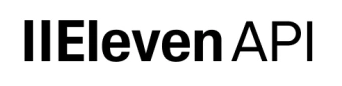
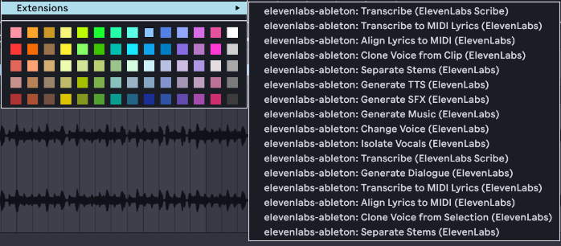
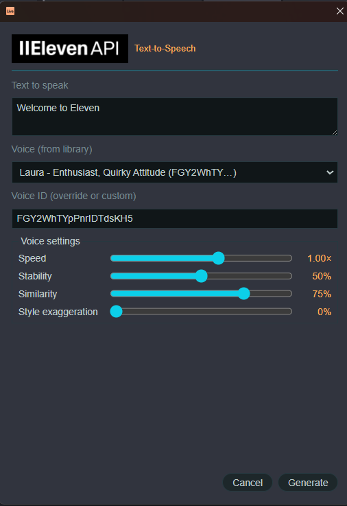
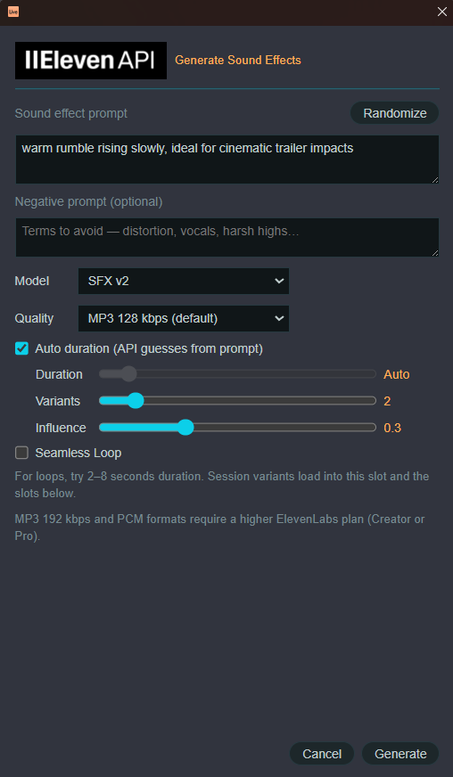
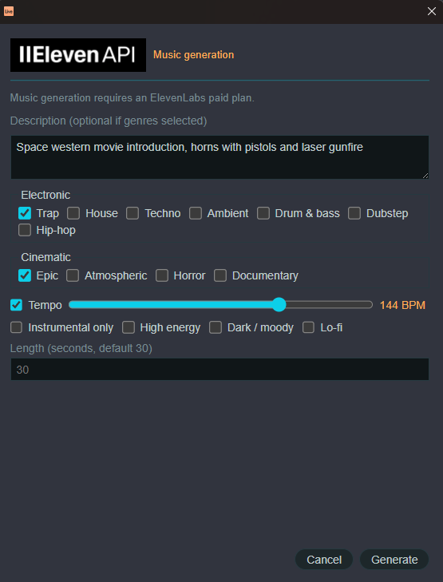
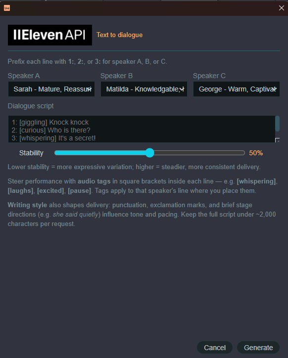
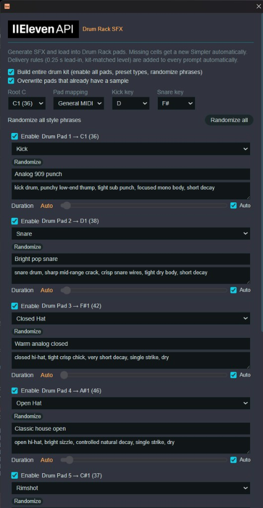

<div align="center">

&nbsp;&nbsp;

</div>
<br>

# Ableton Extension: elevenlabs-ableton

Bring **ElevenLabs** API integration into **Ableton Live** — text-to-speech dialogue, sound effects generation, music generation, voice transformation, transcription, stem separation, voice cloning, batch processing, and more — directly from Live context menus.

**Current release: [v0.7.0](CHANGELOG.md#v070)** · [Changelog](CHANGELOG.md) · [Contents](SUMMARY.md) · [License (GPL-3.0+)](LICENSE)


| Field                        | Value                                                         |
| ---------------------------- | ------------------------------------------------------------- |
| **Extension version**        | `0.7.0` — **27** context-menu features                        |
| **Ableton Extensions API**   | `1.0.0` (`minimumApiVersion` in `manifest.json`)              |
| **Ableton SDK**              | `@ableton-extensions/sdk` **1.0.0-beta.0**                    |
| **ElevenLabs SDK**           | `@elevenlabs/elevenlabs-js` **^2.60.0**                       |
| **Live requirement**         | **Live 12.4 Alpha/Beta** (Centercode) with Extensions enabled |
| **Node.js** (dev/build only) | **≥ 24.16.0**                                                 |


> Extensions are not available in retail Live builds today. You need a Live 12.4 program build with Extensions support. **End users** install a packaged `.ablx` from [Releases](CHANGELOG.md); **developers** use `npm start` with **Developer Mode** (see [Getting started](#getting-started-git--github)).

## Overview

### Screenshots

Context menus and generation modals in Live 12.4 (Extensions):


| Feature                 | Screenshot                      |
| ----------------------- | ------------------------------- |
| Extension context menus |  |
| Generate Text-to-Speech |  |
| Generate Sound Effects |  |
| Generate Music |  |
| Generate Dialogue |  |
| Generate Drum Rack SFX |  |


---

## ElevenLabs API Ableton Extension

### Current Capabilities

Right-click clips, tracks, slots, devices, or selections in Live to access ElevenLabs workflows. Generated audio is imported into your Live Set automatically.


| Category          | Actions                                                                                                              | Where                                              |
| ----------------- | -------------------------------------------------------------------------------------------------------------------- | -------------------------------------------------- |
| **Generate**      | TTS (Flash v2.5 / Eleven v3), SFX, Music (v1/v2), Dialogue, **Music inpainting** (extend, regenerate, loop, similar) | Clip slot, arrangement selection, audio clip |
| **Batch**         | TTS to multiple session slots                                                                                        | Multi-selected clip slots                          |
| **Transform**     | Voice changer, vocal isolation (arrangement + Session clips/slots)                                                   | Arrangement selection, audio clip, audio clip slot |
| **Stems**         | Separate into 2 or 6 stems → new tracks                                                                              | Audio clip, arrangement selection                  |
| **Transcribe**    | Scribe STT (text modal)                                                                                              | Audio clip, arrangement selection                  |
| **Lyrics → MIDI** | Scribe word timestamps → MIDI markers                                                                                | Audio clip, arrangement selection                  |
| **Align lyrics**  | Forced alignment with your transcript → MIDI                                                                         | Audio clip, arrangement selection                  |
| **Samples**       | TTS / SFX into Simpler                                                                                               | Simpler device                                     |
| **Drums**         | SFX into drum rack — seven pad slots, Build entire kit, Sequential or GM mapping                                     | Drum rack, MIDI clip slot                          |
| **Voice**         | Library picker in modals                                                                                             | TTS, voice changer, dialogue                       |
| **Clone voice**   | Instant voice clone from audio                                                                                       | Audio clip, arrangement selection                  |
| **Pronunciation** | Custom word pronunciation for TTS                                                                                    | Audio track (any)                                  |


**v0.7.0** adds **Music inpainting** (Music v2): extend, regenerate section, seamless loop, and generate similar music on audio clips and arrangement selections. TTS modals include an **Eleven v3** model picker with audio-tag hints.

**v0.5.0** Session **Isolate Voice** on audio clip slots and clips replaces the clip in place and preserves loop settings.

**v0.4.0** arrangement TTS also applies light post-import FX (track volume + reverb mix when available).

### SFX, Music & Drum Rack modals

Generation modals share the extension’s dark theme, **Randomize** prompt button, and progress feedback. Options below apply to **Generate SFX**, **Generate Music**, and **Drum Rack SFX** unless noted.

#### Sound effects (`Generate SFX`)

Right-click a **clip slot**, **arrangement selection**, or **Simpler** → **Generate SFX (ElevenLabs)**.


| Control              | Description                                                                                                                                                                        |
| -------------------- | ---------------------------------------------------------------------------------------------------------------------------------------------------------------------------------- |
| **Randomize**        | Fills the prompt with a random descriptive phrase (word banks + templates; loop adds a seamless-loop suffix).                                                                      |
| **Duration**         | Slider **0.5–30 s**, or **Auto duration** (on by default). Toggle sits above the slider.                                                                                           |
| **Variants**         | Slider **1–10**. **Session View:** each variant loads into the **selected clip slot and consecutive slots below** (no picker). **Arrangement / Simpler:** variant picker when > 1. |
| **Prompt influence** | Slider **0–1** (default 0.3).                                                                                                                                                      |
| **Negative prompt**  | Optional terms to avoid; appended to the text prompt as an “Avoid: …” clause.                                                                                                      |
| **Auto duration**    | On by default — omits length so the API guesses from the prompt (0.5–30 s).                                                                                                        |
| **Quality**          | MP3 bitrates, PCM, or Opus. MP3 192 / PCM need Creator or Pro.                                                                                                                     |
| **Seamless Loop**    | Enables loop generation (SFX v2).                                                                                                                                                  |


Imported clips respect the loop toggle (Session clip **Loop** is set in Live when enabled).

#### Music (`Generate Music`)

Right-click an **audio clip slot** or **arrangement selection** → **Generate Music (ElevenLabs)**. Requires a **paid ElevenLabs plan**.


| Control              | Description                                                                                                                                                                                                    |
| -------------------- | -------------------------------------------------------------------------------------------------------------------------------------------------------------------------------------------------------------- |
| **Duration**         | **Auto duration** off by default. Manual slider **3–600 s** (default **30 s** when auto is off).                                                                                                               |
| **Description**      | Free-text prompt; optional if at least one **genre** is selected.                                                                                                                                              |
| **Randomize**        | Random rich music prompt (genres, instruments, mood, production, cinematic flavor).                                                                                                                            |
| **Variants**         | Slider **1–10**. **Session View:** each variant loads into the **selected clip slot and consecutive slots below** on the same track (no picker). **Arrangement:** multi-variant still uses the variant picker. |
| **Genres**           | Single grid: electronic (Trap, House, Techno, …), cinematic styles (Epic, Horror, Sci-Fi, Bollywood, …), and styles such as Jazz, Folk, 80s Retro, Acoustic, etc.                                              |
| **Mood toggles**     | Folded into **Genres** (Dark, Lo-fi, Instrumental, etc.). Instrumental also sets API `force_instrumental`.                                                                                                     |
| **Set tempo**        | On by default; slider starts at **Live’s set tempo** and adds BPM to the prompt. When enabled, generate also sets **`song.tempo`** in the Live Set.                                                            |
| **Prompt influence** | Slider **0–1** (default 0.3).                                                                                                                                                                                  |
| **Negative prompt**  | Optional comma-separated styles to avoid (e.g. vocals, distortion). Uses a **composition plan** with `negative_global_styles` instead of plain prompt mode.                                                    |
| **Auto duration**    | Off by default — sends `music_length_ms` from the duration slider (default 30 s). Check to let the API pick length from the prompt.                                                                            |
| **Quality**          | MP3 bitrates, PCM, or Opus (`output_format`). MP3 192 / PCM need Creator or Pro.                                                                                                                               |
| **Model**            | **Music v2** (default) or **Music v1** — inline row, half-width dropdown. v2 supports inpainting and optional seed. |
| **Seamless Loop**    | Uses API `loop` generation mode; clip **Loop** is set in Live on import.                                                                                                                                       |


The composed prompt merges selected genres, optional tempo, and your description before calling the music API (direct `/v1/music` POST for v2 / loop support).

#### Drum Rack SFX (`Drum Rack` / MIDI clip slot context menu)

Right-click a **Drum Rack** or a **MIDI clip slot** → **Generate Drum Rack SFX (ElevenLabs)**. On an empty MIDI track (no devices), an empty Drum Rack is inserted automatically. Modal title: **Drum Rack SFX**. Seven pad slots, each with:


| Control             | Description                                                                  |
| ------------------- | ---------------------------------------------------------------------------- |
| **Enable**          | Default: only Pad 1 enabled (not persisted).                                 |
| **Type**            | Kick, Snare, Open Hat, Closed Hat, Rimshot, Perc, Clap, Other.               |
| **Style phrase**    | Randomizable mood/style text; 20 phrases per type.                           |
| **Characteristics** | Editable sound character (delivery rules added automatically at generation). |
| **Duration + Auto** | Per-pad duration slider or API auto-duration (default on).                   |


**Build entire drum kit** enables all 7 pads, presets types, and randomizes style phrases. **Root C** selects the anchor note (C-2 through C3, default C1). **Pad mapping** is **Sequential** (consecutive from root C) or **General MIDI** (GM offsets by drum type). **Kick key** and **Snare key** apply optional pitch character. **Overwrite occupied** replaces pads that already have samples. Uses **SFX v2** only. Missing Simplers are created automatically. Last pad layout (except enable state) is remembered in `elevenlabs-config.json`.

Each enabled pad is a separate ElevenLabs API call (uses credits accordingly).

---

### Prerequisites

1. **ElevenLabs account** with API access — [elevenlabs.io](https://elevenlabs.io)
2. **Live 12.4 Alpha/Beta** with extensions enabled
3. An **API key** (see below)

### Storage directory & API key

The extension needs an ElevenLabs API key and a **storage directory** — a folder on disk that Live’s Extension Host can read and write. That folder holds your key (optional file-based setup) and persisted extension settings.

#### Where to keep `api-key.txt`

Create a folder **outside** the extension git repo (do not commit secrets). Put a single-line file named `api-key.txt` in that folder:

```text
C:\Users\You\Documents\ElevenLabs\api-key.txt     # Windows example
/Users/you/Documents/ElevenLabs/api-key.txt       # macOS example
```

The file should contain **only** your API key (one line, no quotes, no extra spaces). Example:

```text
sk_xxxxxxxxxxxxxxxxxxxxxxxxxxxxxxxx
```

You can use any path you prefer — e.g. `~/ElevenLabs/`, a cloud-synced folder, or a parent folder next to your clone when developing. What matters is that the **same folder** is passed as `--storage-directory` (or via `.env`) when you launch the extension.

#### How to configure the storage directory

Tell the Extension Host which folder to use:


| How you run the extension     | What to set                                                                                            |
| ----------------------------- | ------------------------------------------------------------------------------------------------------ |
| **`npm start`** (development) | `ELEVENLABS_STORAGE_DIRECTORY` in project `.env` (see [Getting started](#getting-started-git--github)) |
| **`extensions-cli run`** | `--storage-directory /path/to/your/folder`                                                             |
| **Either**                    | Environment variable `ELEVENLABS_STORAGE_DIRECTORY` (absolute path recommended)                        |


Example `.env` in the project root (gitignored):

```env
EXTENSION_HOST_PATH=C:\Path\To\Live\...\ExtensionHostNodeModule.node
ELEVENLABS_STORAGE_DIRECTORY=C:\Users\You\Documents\ElevenLabs
# Optional — defaults to {storage}/.elevenlabs-temp
# ELEVENLABS_TEMP_DIRECTORY=C:\Users\You\Documents\ElevenLabs\.elevenlabs-temp
```

`npm start` reads `.env`, resolves the storage path, and passes `--storage-directory` and `--temp-directory` to `extensions-cli` automatically. If `ELEVENLABS_STORAGE_DIRECTORY` is unset, it looks for `api-key.txt` in the parent of the project folder, then in the project root (developer convenience only).

Manual launch (same paths as above):

```bash
extensions-cli run --storage-directory "C:\Users\You\Documents\ElevenLabs" --temp-directory "C:\Users\You\Documents\ElevenLabs\.elevenlabs-temp"
```

#### How the API key is resolved

At runtime the extension looks for a key in this order:

1. Environment variable `ELEVENLABS_API_KEY` (if set in the Extension Host process)
2. File `{storageDirectory}/api-key.txt`

If neither is found, the extension prompts you to **paste your API key** in a modal, validates it when online, and saves it to `api-key.txt`. Right-click a **Drum Rack** or **Audio Track** → **Manage ElevenLabs API Key** to update or remove the saved key later.

**Never commit your API key.** Do not place `api-key.txt` inside the repo or add it to git. Use a personal folder + `ELEVENLABS_STORAGE_DIRECTORY`, or set `ELEVENLABS_API_KEY` only in your local shell / `.env` (gitignored).

### Extension Host compatibility

Live's Extension Host omits some Web APIs (`Response`, `URL`, native `FormData`, etc.). The bundle uses a minimal Node shim banner plus `formdata-polyfill` for non-file requests. **File uploads** (stem separation, STT, voice clone) use manual multipart in `src/multipart-upload.ts` because `fetch` + the FormData polyfill drops file parts. See [AGENTS.md](AGENTS.md) before changing the build or upload path.

### ElevenLabs plan limits

Some APIs require a **paid ElevenLabs plan** (e.g. **Music generation**, **stem separation**). On a free tier, those actions show an error dialog instead of crashing — e.g. `Music API is not available for free users`. TTS and SFX typically work on free/creator tiers depending on your quota.

### Install & run (pre-built `.ablx`)

Download `elevenlabs-ableton-0.7.0.ablx` from a [GitHub Release](CHANGELOG.md) (or build locally — see [Package for release](#package-for-release)).

1. Open **Live → Preferences → Extensions**
2. **Drag and drop** the `.ablx` onto the Extensions page
3. Enable the extension in the list
4. Configure your [API key and storage directory](#storage-directory--api-key)
5. Right-click in Live — menu items are prefixed with **(ElevenLabs)**

Developer Mode is **not** required for installed `.ablx` files; it is only needed when running from source via `npm start` / `extensions-cli run`.

### Persisted settings (in your storage directory)

When a storage directory is configured, the extension also reads/writes:


| File                     | Contents                                                                                     |
| ------------------------ | -------------------------------------------------------------------------------------------- |
| `api-key.txt`            | Your API key (optional if you use `ELEVENLABS_API_KEY` instead)                              |
| `elevenlabs-config.json` | Cloned voice IDs, pronunciation dictionaries, active dictionary, last-used drum kit settings |


Temp audio before Live import is written under **`{storageDirectory}/.elevenlabs-temp`** by default (or `ELEVENLABS_TEMP_DIRECTORY` if set). That folder is safe to delete; it is recreated as needed.

---

## Features by release


| Version   | Highlights                                                                                                      |
| --------- | --------------------------------------------------------------------------------------------------------------- |
| **0.1.0** | TTS → clip slot & arrangement                                                                                   |
| **0.2.0** | SFX, music, batch TTS, voice changer, vocal isolation, Scribe, Simpler workflows, post-import FX                |
| **0.3.0** | Voice library picker, text-to-dialogue, drum rack SFX, transcribe → MIDI                                        |
| **0.4.0** | Stem separation, voice clone, forced alignment → MIDI, pronunciation rules; enhanced SFX/Music/Drum Rack modals |
| **0.5.0** | Session voice isolation; SFX/Music modal UX; Live tempo sync; audio-slot guards; UI layout polish               |
| **0.6.0** | Drum Rack SFX pad-slot modal; API key onboarding & management; MIDI clip slot drum entry                        |
| **0.7.0** | Music inpainting (extend/regenerate/loop/similar); Eleven v3 TTS; Music v2 defaults; table-driven context menus |


Full history: [CHANGELOG.md](CHANGELOG.md). Per-feature versions: `src/version.ts` → `FEATURE_VERSIONS`.

---

## Roadmap

### Shipped (v0.6.0)

- **Drum Rack SFX** — pad-slot modal, Root C, Sequential/GM mapping, Build entire kit, MIDI clip slot menu, SFX v2 only
- **API key** — onboarding modal, Manage API Key, show/hide saved key

### Shipped (v0.5.0)

- Session **Isolate Voice** on audio clip slots and clips
- SFX / Music modal layout — titles, auto-duration defaults, tempo sync, half-width Model/Quality rows
- Audio-track clip slot guards for Session generators

### Shipped (v0.4.0)

- Music stem separation → multi-track with mixer balance
- Instant voice clone (persisted)
- Forced alignment → MIDI lyric markers
- Pronunciation dictionary rules (auto-applied to TTS)
- SFX / Music / Drum Rack modals — sliders, models, loops, randomizers, music session multi-variant clip loading

### Planned (v0.6.0+)


| Priority | Feature                                                  |
| -------- | -------------------------------------------------------- |
| High     | Settings / voice manager (cloned voices + pronunciation) |
| High     | Voice picker search + pagination                         |
| Medium   | TTS model picker + character/usage hint                  |
| Medium   | TTS timestamps → MIDI lyric markers                      |
| Later    | Voice design, dubbing, cue-point TTS                     |


Details: [docs/roadmap.md](docs/roadmap.md)

---

## Developers Guide

### Architecture (short)

```text
Context menu → command → modal (optional) → progress dialog
  → ElevenLabsClient (@elevenlabs/elevenlabs-js)
  → temp file → importIntoProject → createAudioClip / replaceSample / MidiClip.notes
```

Outbound audio (voice change, STT, stems, clone): `renderPreFxAudio` → ElevenLabs file APIs.

All dependencies are **bundled** into `dist/extension.js` (~8 MB) via esbuild. The Extension Host does not resolve `node_modules` at runtime.

### Project structure

```text
elevenlabs-ableton/
├── manifest.json          # Extension metadata + minimumApiVersion
├── package.json
├── build.ts               # esbuild bundle (CJS, .html as text)
├── src/
│   ├── extension.ts     # activate(), commands, context menus
│   ├── version.ts         # EXTENSION_VERSION + FEATURE_VERSIONS
│   ├── elevenlabs-client.ts
│   ├── pipelines.ts
│   ├── audio-io.ts / live-io.ts / midi-io.ts / …
│   ├── multipart-upload.ts # Manual multipart for Extension Host file APIs
│   ├── ui-branding.ts     # Modal logo + shared dark theme
│   ├── ui.ts + ui/*.html  # Live webview modals
│   └── ui/assets/         # elevenapi-logo.png, ableton-logo.png (README + bundled modals)
├── vendor/                # Ableton SDK + CLI .tgz (see setup below)
├── docs/                  # BMad project knowledge
├── bmad-output/           # Sprint / implementation artifacts
├── dist/                  # Built extension (gitignored — run npm run build)
├── CHANGELOG.md
└── LICENSE                # GPL-3.0-or-later
```

Deeper context: [docs/project-context.md](docs/project-context.md), [../ABLETON-ELEVENLABS-RESEARCH.md](../ABLETON-ELEVENLABS-RESEARCH.md).

### SDK & dependency versions


| Package                     | Version                        | Role                              |
| --------------------------- | ------------------------------ | --------------------------------- |
| `@ableton-extensions/sdk`   | `1.0.0-beta.0` (vendor `.tgz`) | Live object model, UI, resources  |
| `@ableton-extensions/cli`   | `1.0.0-beta.0` (vendor `.tgz`) | `extensions-cli run` / `package`  |
| `@elevenlabs/elevenlabs-js` | `^2.51.0`                      | ElevenLabs API (bundled)          |
| `fflate`                    | `^0.8.3`                       | Stem separation ZIP extraction    |
| `esbuild`                   | `0.28.0`                       | Production bundle                 |
| `typescript`                | `^5.9.3`                       | Type-check (`skipLibCheck: true`) |


Ableton extensions docs: [ableton.github.io/extensions-sdk](https://ableton.github.io/extensions-sdk/)

---

## Getting started (Git / GitHub)

### 1. Clone the repository

```bash
git clone https://github.com/YOUR_ORG/elevenlabs-ableton.git
cd elevenlabs-ableton
```

### 2. Install Node dependencies

```bash
npm install
```

Requires **Node.js ≥ 24.14.1** (matches `package.json` `engines`).

### 3. Add Ableton SDK vendor packages

`package.json` references local tarballs (not published to npm):

```text
vendor/ableton-extensions-sdk-1.0.0-beta.0.tgz
vendor/ableton-extensions-cli-1.0.0-beta.0.tgz
```

Obtain these from the [Ableton Extensions SDK](https://ableton.github.io/extensions-sdk/) release (or your SDK dev kit) and place them in `vendor/` before `npm install`. Without them, install will fail.

### 4. Configure the Extension Host path

Create or edit `.env` in the project root (gitignored):

```env
EXTENSION_HOST_PATH=C:\Path\To\Live\Resources\Extensions\ExtensionHostNodeModule.node
```

The path is set when you scaffold with `@ableton-extensions/create-extension`; adjust if Live is installed elsewhere.

### 5. Configure storage directory & API key

See [Storage directory & API key](#storage-directory--api-key) for the full user-facing guide. Minimal developer setup:

1. Create a folder **outside** the repo, e.g. `C:\Users\You\Documents\ElevenLabs`
2. Save your key as `api-key.txt` in that folder (one line)
3. Add to `.env`:

```env
ELEVENLABS_STORAGE_DIRECTORY=C:\Users\You\Documents\ElevenLabs
```

**Alternative — environment variable only** (no `api-key.txt`):

```bash
# PowerShell
$env:ELEVENLABS_API_KEY = "your-key-here"

# bash
export ELEVENLABS_API_KEY=your-key-here
```

You still need `--storage-directory` (or `ELEVENLABS_STORAGE_DIRECTORY`) if you want cloned voices and pronunciation rules persisted in `elevenlabs-config.json`.

### 6. Build and run in Live

```bash
# Development (source maps, not minified) — uses .env storage + temp paths
npm start

# Or explicitly (replace with your storage folder from step 5):
npm run build:dev
extensions-cli run --storage-directory "C:\Users\You\Documents\ElevenLabs" --temp-directory "C:\Users\You\Documents\ElevenLabs\.elevenlabs-temp"
```

```bash
# Production bundle
npm run build

# Package for distribution (.ablx)
npm run package
```

### 7. Enable in Live

1. Open **Live 12.4 Alpha/Beta**
2. Preferences → **Extensions** → enable **Developer Mode**
3. Run `npm start` (or `extensions-cli run`) so Live loads the extension
4. Confirm in the Extension Host console: `[elevenlabs-ableton] v0.7.0 active — 27 features`

---

## Package for release

From the project root, with **Node.js ≥ 24.14.1** and `vendor/*.tgz` SDK packages installed:

```bash
npm install
npm run check:api          # optional — needs ELEVENLABS_API_KEY
npm run package            # production build + elevenlabs-ableton-0.7.0.ablx
```

`npm run package` runs `npm run build` first (type-check, esbuild bundle, post-build checks), then `extensions-cli package`. The `.ablx` file is written next to the project (gitignored). Attach it to a GitHub Release and update release notes from [CHANGELOG.md](CHANGELOG.md#v060).

Manual steps before tagging: align versions in `src/version.ts`, `manifest.json`, and `package.json`; run [docs/pre-release-checklist.md](docs/pre-release-checklist.md).

---

## Development workflow


| Task             | Command / location                                                   |
| ---------------- | -------------------------------------------------------------------- |
| Type-check       | `npx tsc --noEmit` (part of `npm run build`)                         |
| Dev build + run  | `npm start`                                                          |
| Production build | `npm run build`                                                      |
| Package `.ablx`  | `npm run package`                                                    |
| Bump release     | `src/version.ts` + `manifest.json` + `package.json` + `CHANGELOG.md` |
| Add a feature    | Register in `FEATURE_VERSIONS` in `version.ts`                       |


### Adding a new feature (convention)

1. API wrapper in `src/elevenlabs-client.ts`
2. Pipeline in `src/pipelines.ts` (use `withElevenLabsProgress`)
3. Modal in `ui/*.html` + prompt in `src/ui.ts`
4. Command + context menu in `src/extension.ts`
5. Document in `CHANGELOG.md` and bump version

### BMad Method

This project uses [BMad](https://docs.bmad-method.org/) for planning artifacts:

- Agent entry: [AGENTS.md](AGENTS.md)
- Sprint status: `bmad-output/planning-artifacts/sprint-status.yaml`
- Team config overrides: `_bmad/custom/config.toml`

---

## npm scripts


| Script                   | Description                                                                     |
| ------------------------ | ------------------------------------------------------------------------------- |
| `npm start`              | `build:dev` then `extensions-cli run`                                           |
| `npm run build`          | Type-check + production bundle → `dist/extension.js` (runs `check:build` after) |
| `npm run build:dev`      | Type-check + dev bundle (source maps)                                           |
| `npm run package`        | Production build + create `.ablx` archive                                       |
| `npm run check:build`    | Post-build: version sync, bundle markers, unit checks (no API key)              |
| `npm run check:api`      | Above + ElevenLabs API smoke (TTS + voices; needs API key)                      |
| `npm run check:api:full` | Above + SFX test (extra API cost)                                               |


```bash
# After clone — validate before opening Live
npm install
npm run build
npm run check:api    # optional; requires ELEVENLABS_API_KEY
```

See [docs/pre-release-checklist.md](docs/pre-release-checklist.md) and [docs/roadmap.md](docs/roadmap.md).

---

## Documentation index


| Document                                                               | Audience                           |
| ---------------------------------------------------------------------- | ---------------------------------- |
| [CHANGELOG.md](CHANGELOG.md)                                           | Release notes (v0.1.0 → v0.6.0)    |
| [SUMMARY.md](SUMMARY.md)                                               | Table of contents for this README  |
| [LICENSE](LICENSE)                                                     | GPL-3.0-or-later terms             |
| [docs/roadmap.md](docs/roadmap.md)                                     | Planned features                   |
| [docs/v0.6.0-features.md](docs/v0.6.0-features.md)                     | Latest feature spec                |
| [docs/v0.5.0-features.md](docs/v0.5.0-features.md)                     | v0.5.0 feature spec                |
| [docs/v0.4.0-features.md](docs/v0.4.0-features.md)                     | v0.4.0 feature spec                |
| [docs/code-review-notes.md](docs/code-review-notes.md)                 | Architecture review notes          |
| [docs/project-context.md](docs/project-context.md)                     | Lean dev/agent context             |
| [../ABLETON-ELEVENLABS-RESEARCH.md](../ABLETON-ELEVENLABS-RESEARCH.md) | Full ElevenLabs ↔ Ableton research |
| [AGENTS.md](AGENTS.md)                                                 | Cursor / BMad agents               |


---

## License & attribution

- **License:** [GNU General Public License v3.0 or later](LICENSE) — Copyright (C) 2026 Tom Carlile
- **Author:** Tom Carlile (`manifest.json`)
- **Ableton Extensions SDK** — [Ableton](https://www.ableton.com)
- **ElevenLabs API** — [ElevenLabs](https://elevenlabs.io)

---

## Support & contributing

1. Check [CHANGELOG.md](CHANGELOG.md) and [docs/roadmap.md](docs/roadmap.md) for known scope
2. Open a GitHub issue with Live version, extension version (`src/version.ts`), and steps to reproduce
3. PRs: follow the feature convention above; bump `FEATURE_VERSIONS` and `CHANGELOG.md`

**Quick sanity check after clone:**

```bash
npm install
npm run build
# expect: dist/extension.js ~8 MB, exit 0
```

